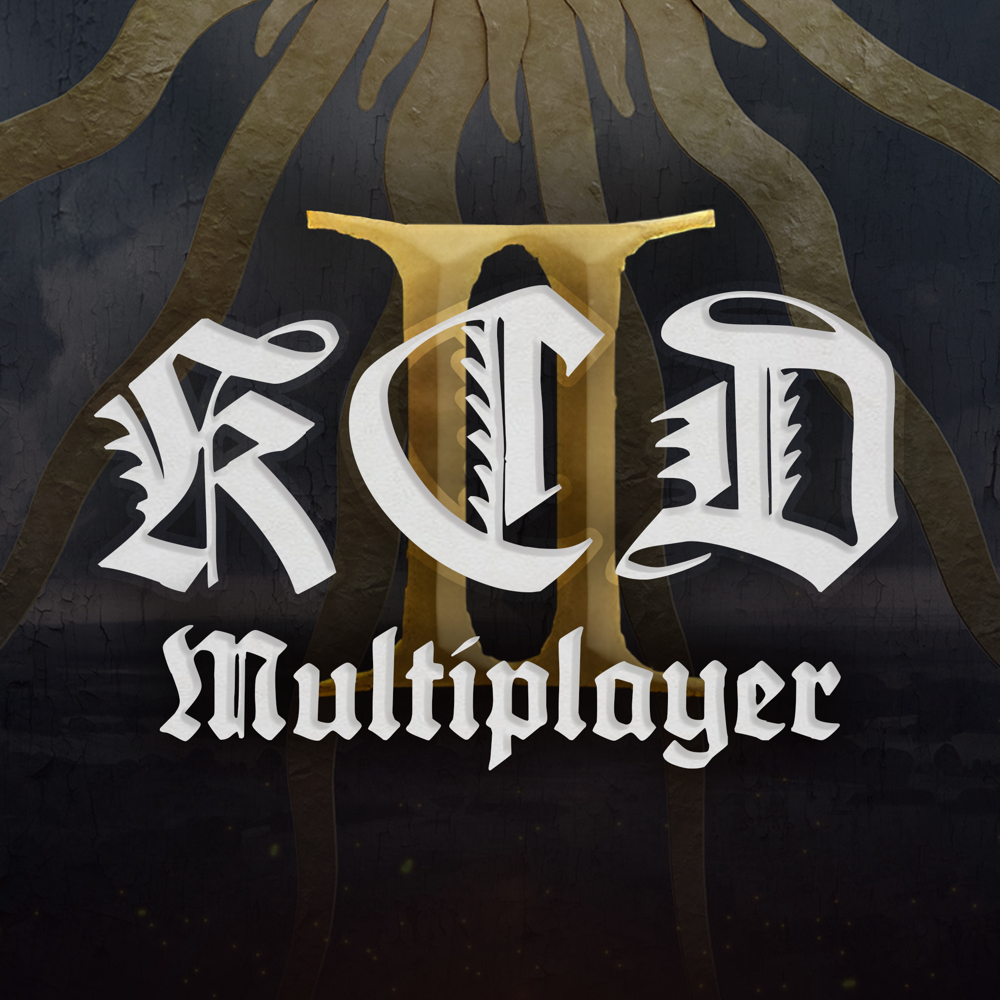

<p align="center">
  
</p>

<h1 align="center">KCD2 Multiplayer</h1>
<p align="center"><em>An unofficial co-op mod for Kingdom Come: Deliverance II.</em></p>

<p align="center">
  <a href="docs/releases/RELEASE-NOTES-0.22.4.md"></a>
  <a href="https://github.com/DeepFriedDepp/kcd2-multiplayer_Reworked/releases/latest"></a>
  <a href="LICENSE"></a>
  <a href="docs/LAUNCHING.md"></a>
  <a href="https://discord.gg/WPCAcG4H4"></a>
</p>

Two or more people play the same open world together at once: you see each
other as ghost NPCs (position, animation, nameplates, and each other's
actual equipped armor *and* weapons — not one fixed costume), hear each
other over proximity voice chat, can land shared damage on each other and on
the world's NPCs, and can play a full relay-authoritative game of Farkle dice
against each other from inside the game itself.

> **Not affiliated with, endorsed by, or supported by Warhorse Studios.**
> Kingdom Come: Deliverance is a trademark of Warhorse Studios; this is a
> non-commercial fan project.

> **Two version numbers**. `main` (this
> repo's source) is ahead of the last published installer; the feature list
> below describes `main`. Installing from the
> [releases page](https://github.com/DeepFriedDepp/kcd2-multiplayer_Reworked/releases)
> gets you that published build's feature set, not everything described
> here — [Building from source](#building-from-source) gets you current
> `main`.

<!-- screenshot/gif here -->

## Contents

- [Features](#features)
- [How to play with a friend](#how-to-play-with-a-friend)
- [Install](#install)
- [How to play dice](#how-to-play-dice)
- [Architecture](#architecture)
- [Repository layout](#repository-layout)
- [Building from source](#building-from-source)
- [Testing](#testing)
- [What's left, and reporting bugs](#whats-left-undone-what-still-needs-a-human-and-reporting-bugs)
- [License and provenance](#license-and-provenance)

## Features

At a glance — every row is expanded with the full evidence, caveats and
known rough edges in [the detailed status table](#full-status-detail) below.
"Unverified" always means exactly that, never "probably fine."

| Feature | Status |
|---|---|
| Ghost presence (position, animation, nameplates, per-player face) | ✅ Working |
| Appearance sync (real armor & weapons, not a costume) | ✅ Working solo — ⚠️ unverified with 2 real humans |
| Shared combat (damage & death on world NPCs) | ✅ Working solo — ⚠️ unverified with 2 real humans |
| Shared Quests (main-story readiness prompt, opt-in catch-up) | ⚠️ Ran live once (WO-95); **WO-96 re-gated the prompt on story divergence and added the WAITING FOR PEER status** — synthetic-verified (110/110), the new gating **not yet run live**; main quests M01–M51 only |
| Shared player health/death (HP on nameplate, death → reload) | ✅ Working, live-verified |
| NPC hits on a player crossing between machines | 🚧 Built, guards verified — cross-machine hit unverified |
| NPC sync (hand-placed NPCs mirrored across machines) | ✅ Working, on by default — proximity-based authority as of 0.18.2 |
| Reactive ghost combat (self-defense, joins nearby fights) | ⚠️ Working, but suppressed by default — `mp_ghost_isolate` (on by default since WO-68) disables it |
| Proactive NPC aggro on ghosts (`mp_enable_aggro`) | ✅ Working, opt-in, off by default |
| Dropped-item sync (shared pickups, race-safe) | ✅ Working |
| Voice chat | ✅ Working, proximity-based |
| Reconnect / mid-session save-reload recovery | ✅ Fixed, live-verified |
| Time-of-day, weather and horse-identity sync | ✅ Working |
| Farkle dice, played in-game | ✅ Working vs a scripted opponent — ⚠️ unverified with 2 real humans |
| Server browser (master server) | ✅ Working, live-tested |
| Launcher (host/join, dependency handling) | 🚧 Built — end-to-end run unverified |
| One-click installer | ✅ Working — automated + manual tests |
| Emotes | ❌ Not implemented |
| Duelling | ❌ Not implemented |
| Dice wagers | ✅ Working — `mp_dice_wager <amount>` stakes groschen on the next invite |
| Ranged weapon swings on ghosts | ❌ Melee only |

<details>
<summary><a id="full-status-detail"></a><strong>Full status detail — every caveat, every unverified claim</strong></summary>

| Feature | Status |
|---|---|
| Relay (`KcdMpServer.exe`) | **Working** — automated suites green. **WO-81 (0.20.6):** the relay now writes its own log file (`relay<date>.log`, bundled automatically by the launcher's **COLLECT LOGS** button, host-side) and logs every NPC-claim grant/release/reassignment, plus a `[CLAIM-CONTESTED]` line when a claim changes hands fast enough to look like two players' machines fighting over the same NPC. No claim decision changed — this only makes the existing ones visible. Wire-verified (`tools\Test-NpcClaimLifecycle.ps1`, 28/28); the field report that motivated it is not yet re-checked against a live session |
| Agent (`KcdMpClient.exe`) | **Working** |
| Native plugin + injection | **Working** — the liveness race that used to make early injection silently no-op is fixed and verified by a real cold-start injection (the DLL now polls for the game's tick instead of sampling once, and picked the tick up 42s after hooking where it previously aborted at 1s). One **residual gap** remains in the step immediately after it — see below |
| Ghost presence (position/animation/nameplates) | **Working**, including while *you* are in a menu — ghosts keep moving instead of freezing and snapping, measured at 6–7 m of real ghost travel during a menu that previously froze them dead. A peer who is *themselves* in a menu is tagged **`[in menu]`** on their nameplate, confirmed on screen. Your own nameplates stay hidden during your own menu, as before — see below. **WO-78 (0.20.6):** the first real two-player session showed the ghost renderer running 5–21 copies of its own update loop at once — every menu, inventory, dialogue or cutscene longer than a second made the mod believe its timers had died and start another set, and they all resumed together — which is the reported "two steps forward, jitter, one step back". Fixed at the cause (a restart now waits for proof the timers are actually dead) and made harmless (the renderer advances by real elapsed time, so a duplicate loop renders the same frame); a `GHOST CHAIN LEAK CONFIRMED` line plus an on-screen toast now report the condition directly. Verified synthetically (`tools\Test-GhostInterpSynthetic.ps1`, 35/35); **not yet seen live**. **WO-80 (0.20.6):** the pump above previously only engaged for a menu, inventory or skip-time — a real *cutscene* still froze a connected ghost, exactly like a menu did before WO-13. Fixed: the pause detector now also recognizes a `Rendered`-type cutscene (the other cutscene types logged this session don't actually freeze anything, confirmed against real data) and engages the same pump. Confirmed by replaying a real ~60 s cutscene stall through the actual compiled detector code; dialogs are **not yet covered** — the log markers for them proved too noisy to use, and the documented `IsInDialog()` Lua bind needs a live probe before it can ship (see `docs/WO-80-findings.md`). **WO-84 (0.20.8):** connected ghosts were having their animation restarted on *every* 20 ms tick — 50 calls a second standing still, ~100 on horseback, against the NPC path's 1 a second. The field logs attribute **9,037 of 9,192** animation-queue overflow errors in one session to a single entity: the other player's ghost (every other character in the world accounted for 155). Menus make it worse, because the pump above runs at 62–100 Hz into an animation system that is paused and draining nothing. Now restarted on a change plus a 1 s keep-alive, comparing the *clip* and not just the movement state (standing still maps to two clips depending on drawn weapon), with pumped menu frames excluded from the keep-alive: **101 calls → 3** over two seconds. Rollback `mp_ghost_anim_refresh 0`. Whether this resolves the reported "animation isn't smooth" complaint *in general* is **not** established — it removes one large measured source of churn, and the interpolation work above covers others. Verified synthetically (`tools\Test-WO84Synthetic.ps1`, 72/72); **not yet watched live** |
| Ghost faces | **Working** — each connected player is deterministically assigned one of 19 roster slots holding real, hand-placed male NPC souls from the game's own tables (the same name always gets the same face, including across reconnects), instead of every ghost sharing one generic look. **WO-83 (0.20.9):** seven of those souls were the game's own *authority figures* — guards and crime-authority soldiers — and a ghost built from one enforced the drawn-weapon crime for real: in the field it warned a player who drew a weapon near it, then drew and fought, while the other player's ghost (a commoner soul) did nothing. Read from the game's own tables, not guessed; the ghost's own guard voice lines in the joiner's log corroborate it 13 times. The seven slots now hold commoner souls already proven live, swapped in place so the other twelve players' faces do not change (deleting rows would have re-rolled everyone). Distinct faces drop from 19 to 12 for now; **not yet watched live** |
| Reconnecting | **Fixed** — rejoining under a new connection used to orphan your old ghost instead of replacing it, leaving stray duplicate ghosts stacked on top of you; identity, not connection id, now decides which ghost is yours. A related launcher bug is fixed alongside it: closing only the game (not the launcher) and reconnecting could start a second agent process on top of a stale one, with the two fighting over the same ghost forever — visible in-game as an NPC seemingly attached to the player. The launcher now stops any existing agent before starting a new one |
| Appearance sync (ghosts mirror your real equipped armor and weapons) | **Working** against synthetic peers and in real single-machine play — per-item, not a fixed costume; **unverified** with a second real human. Weapons go through the same mechanism as armor and were human-confirmed on screen across swords, an axe, a mace, shield+sword and a crossbow. Individual equip/unequip calls occasionally take several seconds to a couple of minutes to actually land under load — a **known rough edge**, not silently broken, see below |
| Shared combat | **Working** against synthetic peers and in real single-machine play; **unverified** with a second real human |
| Shared player health and death | **Working** — every player's own health and stamina now reach everyone else, so a peer's ghost shows their real `HP`/`ST` on its nameplate instead of looking permanently healthy while its owner is being killed. A player who dies is announced explicitly by their own game (never guessed from health hitting zero) and their ghost is tagged **`[dead - reloading]`**, clearing by itself once they are back in the world. Live-verified end to end on one machine, 17/17. **What death does is ordinary single-player behaviour: you reload your own most recent save.** Nobody else's world reverts — every player has always had a completely separate save, and this mod has never had, and is not getting, a way to sync one player's save into another's |
| NPC hits on a player crossing between players | **Built, guards verified, cross-machine step UNVERIFIED.** An NPC attacking your ghost in someone else's world reports the damage back to you, so NPC combat can hurt a remote player rather than only their stand-in. Exactly one client holds this authority at a time (the relay assigns it) — without that, every player's own NPCs would independently damage everyone and multiply the damage by the player count. All three guards around it are individually verified live, plus a positive control. The actual hit crossing two machines was **not** tested: there is one machine here and no second player. **This does not synchronise NPCs themselves** — each player still sees their own local version of any fight; what's shared is only who got hurt and who died, never the NPC's position, animation or AI state |
| Recovering from a mid-session save reload | **Fixed, live-verified.** Loading a save used to permanently stop that player transmitting at all — they simply vanished for everyone else for the rest of the session — and destroyed every other player's ghost body in their world while leaving the floating nameplate walking around with nothing under it. Both were measured (dead for 197s and 187s respectively, still going when the test ended) and both now recover on their own in about 14 seconds. Two more reload bugs — a peer going invisible after standing still, and an embedded save-file ghost impersonating a live one — were closed in WO-59 |
| Reactive ghost combat (self-defense, joining nearby fights) | **Working, but suppressed by default since WO-68.** A ghost has a real soul and brain, so *un-isolated* it defends itself when attacked (treats it as a crime, arms itself, lands real damage) and joins a fight already happening near it, independent of `mp_enable_aggro` below — verified taking a real player from 100 to 57 HP in one exchange, and separately pursuing and killing another ghost 340 m from where both spawned. But `mp_ghost_isolate`, on by default since WO-68, applies `switch_disabledHitBehavioralReaction` to every ghost, and WO-68 observed exactly this: **a ghost stopped fighting back once isolated.** Turn isolation off to get the behaviour above back. A knocked-out (un-isolated) ghost also gets back up on its own, usually within a minute. Its position is still pinned to its owner's real movement during a networked session, so it cannot step, close, or retreat — a real, unresolved gap. **A ghost's own attacks are not replicated to its owner** — a remote player's character can kill NPCs in your world that its owner never actually attacked, invisibly to them |
| NPC aggro on ghosts (`mp_enable_aggro`) | **Working, opt-in, off by default** — this does NOT turn the reactive combat above on or off; that already happens regardless. What the toggle actually gates is *proactive, faction-wide* hostility: when on, a ghost that lands or receives a hit gets attached to one real hostile faction for ~20s, so *any* nearby NPC of an opposing faction — not just whoever it's already fighting — can recognize and attack it unprompted. When off, that native attach never fires. Verified end-to-end (synthetic peer → relay → agent → native plugin → game) via a live on/off comparison and repeated live fights; **unverified** with a second real human. **Known limits, not bugs** — see below |
| NPC sync (`mp_npc_sync`) | **Working, ON by default** — up to 5 hand-placed NPCs within 30 m of a player mirror that player's world on everyone else's machine: position, walking/running animation, health, death. Costs less bandwidth than one player's position stream. **As of 0.18.2 (WO-60), tracking is proximity-based**: previously only the host's own surroundings were tracked, so an NPC fighting a joining player far from the host was never synced at all. Now whichever machine is actually near an NPC tracks and streams it, with a 15s "engagement hold" so an active fight can't bounce between machines through a brief packet gap. Wire-verified (35/35); **no live two-machine session has run this model yet** — rollback with `mp_npc_proximity off` on the joining machine if it behaves worse than the previous release. **Since 0.20.2 (WO-77)** the receiving side renders synced NPCs by time-based interpolation 120 ms behind the stream instead of a per-tick lerp, and the sender emits at 10 Hz for moving NPCs — this targets the reported "NPC dashes and pauses" jitter; `mp_npc_smooth off` restores the old renderer for a live A/B. Verified synthetically only (`tools\Test-NpcSmoothSynthetic.ps1`, 48/48); **not yet watched by a human in a two-machine session**. **WO-78 (0.20.6):** the update-loop duplication the field session confirmed on this path too (`NPC-SYNC CHAIN LEAK CONFIRMED` on both machines) is fixed at its shared cause; `mp_npc_chainfix` now defaults **on** and the leak line also raises an on-screen toast. **WO-84 (0.20.8):** a *second*, different update-loop leak on this path, which WO-78's gate cannot catch by design — when the sync loop runs out of NPCs it stops itself, having already scheduled its own next tick, and a packet arriving inside that window legitimately restarts it so the orphaned tick wakes inside the new loop and is blamed for a leak it did not cause (a menu widens that window from 50 ms to the whole menu). A loop that stops itself now retires its own pending tick; genuine leaks still report, still toast, and are now counted separately so a second one is not hidden behind the first. Verified synthetically. **Unverified** with a second real human; dialogue with an NPC *while* it is actively being driven is untested (before/after works). **WO-86 (0.21.1):** an NPC's *death* now crosses to the other machine. Until this build no NPC death was ever sent — the death packet had existed since the first combat layer with nobody calling it, so each machine decided "dead" alone from damage deltas and could disagree forever (the field report: a villager dead for the killer, alive and hurt for the other player). A killing blow now carries a FATAL flag and the other machine kills its own copy; a body that is dead only locally no longer follows a living stream (the same report's "corpse kept moving"). `mp_npc_deathsync off` restores the old behaviour. Verified synthetically (`tools\Test-WO86Synthetic.ps1`, 47/47); **not yet watched live** — needs pak, agent and `KCDMP.dll` from this build together |
| Dropped-item sync (`mp_item_sync`) | **Working** — a player who drops an item shares it: peers see it appear at the same spot, anyone can pick it up, and the first pickup wins for everyone (a losing pickup rolls back automatically). Verified across food, a bandage stack, armor and weapons. Late joiners converge via a 30s re-broadcast; a save reload self-heals both directions. Deliberately **not** shared: chests and NPC pockets — each player keeps their own loot pool, only deliberate player-to-player handoffs sync |
| Time-of-day, weather and horse-identity sync | **Working** — a connecting player's clock is pulled forward to match the session's within ~10s, weather is arbitrated and blended across machines (eyeball-verified end to end), and a ridden horse's real identity is adopted by a ghost when that horse is within 60m, falling back to a cosmetic proxy horse otherwise (a hard freeze in this path was diagnosed and fixed) |
| Voice chat | **Working**, proximity-based |
| Session framework (invites/accept/decline) | **Working** |
| Dice engine (Farkle) | **Working** — 59/59 unit tests |
| Dice ↔ relay integration | **Working** headlessly; **unverified** with two real humans |
| In-game dice UI | **Working** — played to completion against a scripted opponent; **unverified** with two real humans |
| Shared Quests (`mp_quest_sync`) | **WO-96: the prompt is now raised from the story-divergence signal, not from beat proximity.** Whenever the two players' journal markers differ, the player who is behind is offered the peer quest's catch-up beat (F11/F12); when there is nothing left to offer — same quest, a quest with no fireable beat such as the whole prologue, or a beat already fired or declined this session — a persistent **WAITING FOR PEER** status row says who is ahead and on what, and goes away on its own when the two converge or the peer leaves (F12 or `mp_quest_hide` hides it until the positions change). It is a status line, not a lock: nothing pauses, no input is gated. Prompts are debounced to one per peer per 60 s (`#KCD2MP_QuestSetGap(n)`), a declined beat is never re-offered, and a beat fired here is spent for the session. Proximity now only refines *which* beat is offered. **Sub-objective gaps are now detected too:** after each journal checkpoint the agent reads the autosave the engine just wrote (the concept-graph state is plain XML inside it) and sends a per-quest objective fingerprint; the other machine compares it against its own newest save and says exactly which objective the peer has that you do not ("Joiner has an objective you do not: Carry the sacks to the pantry."). Where Warhorse authored a clean narrow trigger for that one objective — 22 of the 626 main-quest objectives have one — F11 grants it in place, no teleport; for the other 600-odd (the sacks of M03 among them) the gap is named and nothing more is possible, and the mod says so. Both machines must run the same build or the comparison is refused. Synthetic only (`tools\Test-WO96Synthetic.ps1`, 142/142; unit tests 89/89; the save read verified against the 2026-09-13 host's own saves) — how it feels at the real objective-change rate is the open live check in `docs/WO-96-findings.md`. **Ran live 2026-09-13 (WO-95): the catch-up fires and works, but it fired only 3 times across 5 divergences.** The prompt was raised from beat *proximity*, and most main quests have very few fireable beats (M03 has one), so two players could drift apart for a quarter of an hour with nothing offered. The catch-up also jumps to a point Warhorse authored, not to your peer — confirmed live, all three fires landed on the same spot. See `docs/WO-95-findings.md` s5. Scope is exactly the 32 main-story quests (ProductionCode M01–M51, base game); side quests, activities, events and DLC content have no registry entry and trigger none of this. When a player comes within 35 m (`mp_quest_radius`) of a registered beat of the main quest they are on, the other player — if their objective differs — sees a persistent line in the same top-left text style as the ping: **F11 catch up / F12 stay** (the dice minigame's bank/yield keys, already reused by the dice-invite prompt; they are only ever consumed by the dice board while a match is open). Yes fires Warhorse's own story-jump facility `wh_concept_HasteTrigger <quest>.<trigger>` on the accepting machine — WO-92 found it, confirmed it drives the real graph transitions, and named seven things it does not restore and six ways a replay can cross to the other player; the maintainer accepted those. Not answering is a first-class choice: nothing fires, WO-90's divergence release (stand-off now **180 s**, was 60) remains the only safety net. Nothing pauses for anyone on any path. While a catch-up is draining (120 s, `mp_quest_window`), every death, teleport, clock change and chain suspension on **either** machine is also logged as a distinct `CATCHUP-HAZARD` line naming the beat and who fired it — that is the "fix it when we see it" plan made greppable. The registry is generated from the quest XML by `tools\Build-MainQuestRegistry.ps1` (1,014 triggers, 53 fireable; `docs/WO-94-mainquest-registry.csv`); ten of the 32 quests, including the prologue M01, have no positioned beat and so never prompt. Synthetic only (`tools\Test-WO94Synthetic.ps1`, 94/94): whether the trigger does anything when it reaches the engine, whether F11/F12 arrive as expected, and whether real lead time is usable are the live checks in `docs/WO-94-findings.md` |
| Emotes | **Not implemented** |
| Duelling | **Not implemented** — the wire protocol reserves a slot for it, nothing behind it |
| Master server (server browser backend) | **Working, live-tested** — a community-contributed C# service (`dotnet/KcdMp.MasterServer/`) replaced the never-run Flask service. Relay↔master↔launcher exercised end-to-end with the real code on all three sides: announce, live update, and delisting within ~1s of a relay disconnecting |
| Launcher (host/join, dependency handling) | **Built but unverified end-to-end** — see below. Shares the in-game dice overlay's art direction (aged parchment, oak, gold) across every screen rather than looking like a generic dark app; has a **REPORT BUG** button in the status bar that opens this project's GitHub Issues or Discord; and warns you before you connect if you and your peer are on different mod versions, naming which side needs to update |
| Installer (`KCDMP-Setup-<version>.exe`) | **Working** — silent install/upgrade/uninstall and Steam detection both covered by automated suites (41/41, 21/21) on one machine; the interactive wizard and any clean machine are **unverified**, see `docs/INSTALLER-TESTING.md`. **Hardened against half-applied updates**: Setup refuses to install while the launcher/agent/relay/game is running, verifies every installed file against a size manifest afterwards (verdict in `install-verify.txt`), and the launcher itself warns at startup if the install directory holds a mix of two builds |

**NPC aggro (`mp_enable_aggro`) — known limits, v1 scope, not bugs:**
- **Hitting another player's ghost in a town is a crime.** A ghost is a real
  `Civilians`-faction NPC, so attacking one inside a settlement can draw guard
  aggro onto *you*.
- **One hostile faction for all of v1** — a real bandit faction hostile to
  ordinary townsfolk, not a nuanced per-NPC-type system.
- **The hostile-faction attach depends on a playthrough-specific donor soul**
  (a leftover NPC from a specific earlier ambush sequence). On a save that
  hasn't reached that ambush, the attach fails quietly — logged, not crashed,
  but `mp_enable_aggro` does nothing observable on such a save.
- **Not synchronized between clients** — whether an NPC treats a ghost as
  hostile is decided entirely by that NPC's own player's local toggle and
  local combat events, not agreed between both players.
- **Not tested with a second real human** — verified end-to-end via a
  synthetic peer through the real relay and agent, not a real second player.

</details>

## How to play with a friend

1. Both of you install the mod (below) and the launcher.
2. One of you clicks **HOST GAME** in the launcher — it starts a relay and
   shows you the address to share.
3. The other clicks **ADD SERVER**, enters that address, and clicks **JOIN**.
4. Both of you click through to load into the game world; the launcher
   handles injecting the plugin and starting your agent once you confirm
   you're actually in-game.
5. Once both loaded, ALT+TAB into the launcher and choose the "Connect" option

Same Wi-Fi/LAN: that's it. Different houses: see
**[docs/NETWORKING.md](docs/NETWORKING.md)** for the two ways to connect
over the internet (a VPN overlay like Tailscale — recommended — or port
forwarding), including exactly what address and port to share.

## Install

1. Download **`KCDMP-Setup-<version>.exe`** from the
   [releases page](https://github.com/DeepFriedDepp/kcd2-multiplayer_Reworked/releases).
2. Run it.
3. That's it — use Host or Join as above.

> **One-time step done by Steam/Warhorse's own tools, not ours — do this
> before your first launch, regardless of the order you install things in.**
> The KCD2 Modding Tools app does not ship with its own copy of the game's
> data (animations, characters, tables, scripts, cinematics, and more) — only
> a `Developer.pak`. The first time you install it, launch it **once through
> Steam itself** (its own Play button, or the shortcut Steam creates for it)
> and let **Workspace Setup**
> (`Tools\ModdingWorkspaceSetup\WorkspaceSetup.exe`) run — it copies the
> missing data from your base **Kingdom Come: Deliverance II** install into
> the Modding Tools folder. You need to own and have the base game installed
> too, since that's where the copy comes from.
>
> Skip this and the game will start, then immediately crash:
> *"Database system error — 114 tables are not loaded. See log for details.
> Ensure you have latest tables."* This is **not** this mod and **not** our
> installer — reproduced with the mod entirely removed, same crash. Our
> `Setup.exe` currently has no way to detect it; see "Not done," below.

The installer finds your game through Steam, deploys the mod into it,
installs the launcher, writes the game path into the launcher's settings so
there is nothing to configure, and puts a shortcut on your desktop. If the
free **KCD2 Modding Tools** are not installed it will say so, offer a button
that starts that download in Steam, and refuse to continue until they are
there — the retail game genuinely cannot run this mod, it lacks the debug
API and the module layout the plugin needs.

You need Kingdom Come: Deliverance II on Steam, plus that Modding Tools
entry (free, a separate item in your Steam library). Nothing else: the
launcher, agent and relay carry their own .NET runtime, and the installer
fetches Microsoft's WebView2 runtime if your Windows doesn't already have it.

Installing by hand still works and is documented in
[docs/LAUNCHING.md](docs/LAUNCHING.md) — use it if the installer misbehaves
or your Steam setup is unusual.

### Already installed? Update in 2 steps — no reinstall needed

Everyone you play with needs the same version, not just the host — an old and
a new build won't connect to each other.

Download **`KCDMP-DirectInstall-<version>.zip`** from the
[releases page](https://github.com/DeepFriedDepp/kcd2-multiplayer_Reworked/releases)
and unzip it. It contains two folders, `App` and `Mod`:

1. Copy the **`App`** folder's contents into your existing install folder
   (`%LocalAppData%\KCDMP` — paste that into Explorer's address bar),
   overwriting when asked. Your `settings.json` is not in the zip, so the game
   path you already have is left alone.
2. Copy the **`Mod`** folder's contents into your game's mod folder
   (`<your KCD2 Modding Tools folder>\Mods\kdcmp`), overwriting when asked —
   that's `mod.manifest` and `Data\kdcmp.pak`, the same two files Setup.exe
   deploys there and the only two that belong there.

Close the launcher first. That's it — no need to run Setup.exe again, and
nothing else on your PC is touched. Prefer a full reinstall? Running
`KCDMP-Setup-<version>.exe` over the top does that and keeps your settings
too.

<details>
<summary>Building the installer yourself</summary>

```
powershell -ExecutionPolicy Bypass -File tools\Build-Installer.ps1
powershell -ExecutionPolicy Bypass -File tools\Build-DirectInstall.ps1 -SkipPublish
```

The first publishes everything self-contained and compiles
`release\KCDMP-Setup-<version>.exe`; the second zips that same published
output into `release\KCDMP-DirectInstall-<version>.zip` (`App\` + `Mod\`, as
above), reusing the publish the first one just did. Building the installer
needs [Inno Setup 6](https://jrsoftware.org/isinfo.php)
(`winget install --id JRSoftware.InnoSetup`); the zip needs nothing extra.

Both read the version from the `VERSION` file at the repo root and from
nowhere else, so they cannot disagree about it. That number is chosen by hand,
never bumped automatically — see [docs/VERSIONING.md](docs/VERSIONING.md).

</details>

## How to play dice

Farkle, played against another real player. This is **not** the vanilla dice
minigame — it is a separate relay-authoritative engine with its own board
drawn over the game, so the rules are settled by the relay and neither player
can desync the other. The vanilla NPC minigame is untouched and still works
normally; nothing here interferes with it.

**Before you start:** both of you must be connected (green in the launcher)
and standing near each other in the same part of the world. Dice needs your
two characters close enough for "nearest player" to mean each other.

### 1. Open the game console

Every step that has no keybind yet is a console command. Open the developer
console with **`~`** (the key left of `1`; the Modding Tools build has the
console enabled — retail does not, which is one more reason the mod requires
that build). Type the command, press Enter, press `~` again to close.

### 2. Challenge someone

Walk up to a dice table, sit down if you like, and run:

```
mp_dice
```

That invites the nearest player. If you get *"Sit at a table first"*, the
table gate is on and there is no dice table in range — either move to a real
table, or turn the gate off with `mp_dice_gate off` (it ships **off** by
default, so you should not normally see this).

`mp_dice_table` reports the nearest table it can see, and `mp_dice_seat`
reports the seat under you — both are for working out why a table is not
being recognised.

Want groschen on the line? Run `mp_dice_wager <amount>` before `mp_dice` — it
stakes that amount on the *next* invite you send (0, the default, plays for
score only). The other player sees the stake before accepting; the winner's
inventory is credited and the loser's debited automatically when the match
ends.

### 3. Accept the challenge

The other player sees the invite prompt and runs:

```
mp_accept
```

or `mp_decline` to refuse. The board appears for both of you once accepted.

### 4. Play

Once the board is up, dice is played on **real keys** — no console needed:

| Key | Does |
|---|---|
| `F2` `F4` `F5` `F6` `F7` `F8` | Mark die 1–6 (the numbers under the dice on the board) |
| `F9` | Cast — rolls, or sets aside the dice you marked, depending on the phase |
| `U` | Clear every mark without rolling |
| `F11` *(hold)* | Bank your points and end your turn |
| `F12` *(hold)* | Yield the match |

Bank and yield are **hold-to-confirm**, deliberately — they are irreversible
and a stray tap should not end your turn or the match.

A turn goes: press `F9` to roll → mark the scoring dice you want to keep →
`F9` again to set them aside → roll the rest, or `F11` to bank what you have.
Roll nothing scoring and you **bust**: the board shows what you rolled and
says so, and your turn ends with nothing banked. First to the target score
wins.

Every key above has a console equivalent if a key ever fails you:
`mp_dice_mark 1`…`6`, `mp_dice_cast`, `mp_dice_unmark_all`, `mp_dice_bank`,
`mp_dice_yield`.

### If the board misbehaves

| Command | Use when |
|---|---|
| `mp_dice_redraw` | The board is stale — forces it to re-push |
| `mp_dice_flush` | The board is stuck or flickering — clears every queued panel |
| `mp_dice_close` | You want it gone |

<details>
<summary>Known dice rough edges</summary>

- **Inviting and accepting have no keybind.** `mp_dice`, `mp_accept` and
  `mp_decline` are the reliable path. Key bindings for these exist in the code
  but are built on **guessed** action names (`dialog_answer3/4`,
  `dialog_answer1/2`) that have never been confirmed to fire — treat them as
  not working.
- **A full two-human match has never been played.** Everything above was
  verified against a scripted opponent (`tools\Bot-DiceOpponent.ps1`) on one
  machine.

</details>

## Architecture

```
PC1: [KCD2 + Mod] ←localhost→ [KcdMpClient.exe] ──TCP──┐
                                                          ├── [KcdMpServer]
PC2: [KCD2 + Mod] ←localhost→ [KcdMpClient.exe] ──TCP──┘
```

- **`KcdMpServer`** — the relay. Whoever hosts runs this; everyone else
  connects to its address. Binds all interfaces by default, so LAN and
  VPN-overlay play need no extra config — see `docs/NETWORKING.md`.
- **`KcdMpClient.exe`** — the per-player agent. Reads your local game state
  and pushes it to the relay; receives everyone else's state and drives your
  local ghosts/voice/combat.
- **`KCDMP.dll`** — the native plugin, injected into the game process. Talks
  to the agent over a local named pipe; reads and writes game state through
  the engine's own RTTR reflection layer (exported by `CrySystem.dll`), not
  offsets or signature scans.
- **`KCDMP_launcher`** — the desktop app you actually run: server
  browser/host/join UI, launches the game, drives injection, starts the
  agent.

Each agent only ever talks to its own machine's game — there is no
cross-machine game-API traffic, only the relay TCP connection.

## Repository layout

| Path | What it is |
|---|---|
| `kdcmp/` | The game mod — Lua and the built `kdcmp.pak` |
| `dotnet/KcdMp.Client/` | `KcdMpClient.exe`, the per-PC agent |
| `dotnet/KcdMp.Server/` | `KcdMpServer.exe`, the relay |
| `dotnet/KcdMp.Protocol/` | Shared wire protocol |
| `dotnet/KcdMp.Farkle/` | The dice engine (pure state machine, no external deps) |
| `native/KCDMP/` | The injected plugin (C++) |
| `native/KCDMP_LauncherInjector/` | The injector executable |
| `KCDMP_launcher/` | The desktop launcher (Photino/Blazor) |
| `dotnet/KcdMp.MasterServer/` | `KcdMpMasterServer.exe`, the server-discovery backend — see `docs/MASTER-SERVER.md` |
| `docs/` | Design notes and session handoffs — start with `docs/PROJECT-STATE.md` |

## Building from source

Requires the [.NET 8 SDK](https://dotnet.microsoft.com/download) and, for
the native plugin, VS Build Tools with the C++ workload (CMake + Ninja,
located automatically via `vswhere`).

```powershell
dotnet build KCD2-MP.sln
powershell -File native\Build-Native.ps1
```

To assemble a self-contained release folder (no .NET runtime required on
the target machine — the native plugin already links its C++ runtime
statically, so there's nothing extra to bundle there):

```powershell
powershell -File tools\Publish-Release.ps1
```

Run things directly during development:

```powershell
dotnet run --project dotnet\KcdMp.Server
dotnet run --project dotnet\KcdMp.Client -- --host localhost --name PC1
dotnet run --project KCDMP_launcher
dotnet run --project dotnet\KcdMp.MasterServer
```

The master server (`dotnet/KcdMp.MasterServer/`) is optional — a relay and
launcher with each other's address connect directly and never touch it. See
`docs/MASTER-SERVER.md` for how to point a relay and the launcher at one.

## Testing

```powershell
dotnet run --project dotnet\KcdMp.Server -- --port 7778   # in one window
powershell -File tools\Test-Combat.ps1
powershell -File tools\Test-Sessions.ps1 -IncludeTimeout
powershell -File tools\Test-Dice.ps1
powershell -File tools\Test-PlayerCombat.ps1
dotnet test dotnet\KcdMp.Farkle.Tests
powershell -File tools\Test-WO94Synthetic.ps1                      # Shared Quests, no game needed
powershell -File tools\Test-WO96Synthetic.ps1                      # divergence-gated prompt / WAITING FOR PEER (WO-96), no game needed
```

`tools\Test-Pipe.ps1` additionally needs the real game running with the
plugin injected — see the script header. `tools\Test-AppearanceE2E.ps1` and
`tools\Test-PlayerVitalsE2E.ps1` need the real game and a running agent, but
**not** the native plugin — appearance sync and player vitals never touch the
DLL or the pipe, only the reflection debug API. `tools\Test-ReloadBehaviour.ps1`
needs all of that plus a human to reload a save mid-test. Every synthetic-peer
script derives its wire-protocol version from `tools\ProtocolVersion.ps1`
rather than hardcoding it — never add a new literal version byte to a script.

## What's left undone, what still needs a human, and reporting bugs

<details>
<summary><strong>Not done</strong> — genuinely missing or impossible, as opposed to untested</summary>

- **Emotes** — not implemented.
- **Duelling** — not implemented. The wire protocol reserves an
  `InteractionKind.Duel` value and nothing at all sits behind it; it reads
  like a shipped feature to anyone skimming `Protocol.cs` and it is not one.
- **Dice invite / accept / decline keybinds** — the console commands
  (`mp_dice`, `mp_accept`, `mp_decline`) are the working path. The key
  bindings in the code are built on guessed engine action names that have
  never been confirmed to fire.
- **Ranged weapon swings on ghosts** — melee is fully animated; bow/crossbow
  ranged action names are recorded but not yet wired.
- **Appearance sync's write latency is genuinely variable** — equipping or
  unequipping one item on a ghost usually lands within a second, but under
  heavier load it has taken up to a couple of minutes, and it self-heals via
  a 30-second resend rather than promising a fixed time. `mp_sync_appearance`
  forces an immediate resync if you don't want to wait. Hairstyle, face and
  beard do not sync — no reflected engine surface exposes them at all.
  Weapons *do* sync, through the same mechanism as armor.
- **Unequips are not verified the way equips are** — the agent retries what
  should now be *on* a ghost, but never confirms that what should now be
  *gone* actually went. A weapon unequipped several steps earlier was once
  observed back in a ghost's equipped map, reproducibly, minutes later. Not
  root-caused: it may be the game refilling an empty weapon slot from the
  ghost's own inventory rather than a failed write.
- **The soul walk right after injection still gives up after one 5s try** —
  the tick-liveness check above it now polls and retries; the step after it
  does not. Inject in the narrow window where the game has started ticking
  but a save has not finished loading and that injected instance declines to
  start the pipe, with no second attempt.
- **Reading the vanilla dice minigame's live state isn't possible** — its
  in-progress state isn't reachable from outside it. That's why dice is a
  separate relay-authoritative engine instead of mirroring the vanilla
  minigame.
- **Auto-detecting "you are actually in the world"** — the launcher still asks
  you to confirm you have loaded your save before it injects. Injecting too
  early is no longer fatal (the plugin waits for the game's tick instead of
  giving up on it), but the launcher cannot yet decide for you when you are
  really in the world, so it asks.
- **Nameplates are hidden while *your own* menu is open** — ghost bodies keep
  moving during your menu, but the `System.DrawLabel`/`DrawText` calls that
  draw names are immediate-mode, one frame per call, and the update pump is
  not frame-locked to the renderer. Pumping them would strobe rather than
  render, so they stay off.
- **The installer does not detect an incomplete Modding Tools data
  install** — it verifies `Framework.dll`/`CrySystem.dll` exist beside
  `KingdomCome.exe`, which proves the *engine binaries* are the right build.
  It does not check for the actual game data (`Data\Tables.pak` and the
  other mandatory paks), so a Modding Tools install that has never had its
  one-time **Workspace Setup** step run (see Install, above) passes the gate
  and then crashes the game with "114 tables are not loaded" — a real,
  reproduced failure, not a hypothetical one.
- **Installer code signing** — Setup.exe is unsigned, so a first download
  shows SmartScreen's "Windows protected your PC". Click *More info* →
  *Run anyway*.
- **A moved game is only half-handled** — re-running Setup finds the new path
  and re-deploys the mod, but will not overwrite a `GamePath` already set in
  your `settings.json`. The launcher notices the stale path at startup and
  opens Settings; it does not fix it for you.
- **`settings.json` follows the working directory, not the launcher** — the
  shortcuts the installer creates set it correctly. Launch
  `KCDMP_launcher.exe` from some other directory and it will read and write
  its settings there instead.
- **A claimed NPC's health still converges by damage events only** —
  simultaneous kill/loot arbitration between two players fighting the same
  NPC remains unhandled.
- **Animals don't sync** — chickens, dogs, deer and the like are out of scope
  by design, not a bug.

</details>

### Reporting a bug

The launcher's status bar has a **REPORT BUG** button — it opens either the
GitHub Issues page or this project's Discord directly, whichever you'd
rather use.

Say which side you were on (host or join), what you were doing, and what you
expected instead. Then attach whatever of these exists — the paths are exact,
and `%LocalAppData%` / `%AppData%` / `%Temp%` can be pasted straight into
Explorer's address bar:

| What | Where | Attach it when |
|---|---|---|
| Launcher log | `%AppData%\KCDMP_Launcher\app<YYYYMMDD>.log` | Always. This is the first one to grab |
| Launcher settings | `%LocalAppData%\KCDMP\settings.json` | Always — it is three lines and it says which game it found |
| Native plugin log | `%LocalAppData%\KCDMP\kcdmp-native.log` | Injection, ghosts, combat, or dice not appearing in game |
| Game log | `<ModdingTools>\kcd.log`, e.g. `...\steamapps\common\KCD2Mod\kcd.log` | Anything in-game. Look for `[KCD2-MP]` lines |
| Agent log | `%LocalAppData%\KCDMP\agent.log` (`.prev.log`/`.prev2.log` for the last two runs, since WO-39) | Connected but nothing syncs |
| Relay output | The `KcdMpServer.exe` console window on the **host's** PC | Nobody can join, or people get dropped |
| Installer log | `%Temp%\Setup Log <date> #NNN.txt` — newest one | Anything that went wrong during install |

Also useful: your version (Add/Remove Programs → *KCD2 Multiplayer*), whether
both players are on the same network, and — for anything that looks like the
game ignoring the mod — confirmation that `<ModdingTools>\Mods\kdcmp\` exists
and that you launched through the launcher rather than through Steam.

Please redact your public IP from logs if you were playing over the internet.

## License and provenance

Licensed under the [GNU General Public License v3.0](LICENSE).

This is a fork of [`marczukmichal/kcd2-multiplayer`](https://github.com/marczukmichal/kcd2-multiplayer),
**continued here with the original developer's permission**, including
permission to upstream changes back if the two projects converge. All
credit for the original concept and implementation goes to marczukmichal —
this fork exists to keep building on that work, not to replace it. The
upstream repository carries no license of its own; that's a fact about the
upstream project, not a claim that it was itself GPL-licensed. This fork's
own code, from the point of forking onward, is licensed under GPLv3 as
stated above.
